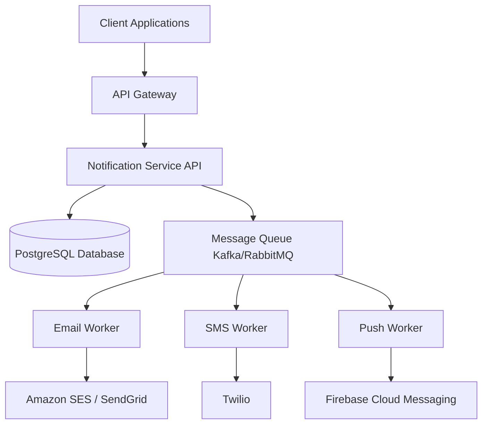

# Notification System Architecture Design

## 1. Overview
The Notification System is designed to be highly scalable, reliable, and capable of sending messages across multiple channels (Email, SMS, Push) to millions of users. It uses a decoupled, event-driven architecture to handle high throughput without blocking the main application flow.

## 2. High-Level Architecture

## 3. Core Components

### 3.1 API Gateway
- Handles rate limiting, authentication, and routing of incoming requests.

### 3.2 Notification Service (Backend API)
- Receives notification requests (e.g., `POST /api/notifications`).
- Validates payload, stores a record in the database with status `PENDING`.
- Publishes the notification event to the Message Queue.

### 3.3 Message Queue (Kafka/RabbitMQ)
- Decouples the API from the actual sending mechanism.
- Ensures reliable delivery and retry capabilities.
- Separate topics/queues for different channels (e.g., `email-queue`, `sms-queue`).

### 3.4 Workers (Consumers)
- **Email Worker**: Consumes from the email queue and interacts with 3rd party providers like SendGrid or Amazon SES.
- **SMS Worker**: Consumes from the SMS queue and integrates with Twilio or SNS.
- **Push Worker**: Integrates with FCM (Firebase) or APNs (Apple).
- Workers update the status in the database to `SENT` or `FAILED`.

### 3.5 Database (PostgreSQL/MongoDB)
- Stores user preferences (opt-in/opt-out).
- Stores notification templates.
- Keeps an audit log of all notifications and their delivery statuses.

## 4. Key Design Decisions & Features

1. **Idempotency**: Workers are designed to be idempotent to avoid sending duplicate messages in case of retries.
2. **Rate Limiting**: Applied per user and per provider to comply with 3rd-party limits.
3. **Template Management**: Notifications are sent via templates, decoupling the core logic from content changes.
4. **Retry Mechanism**: Exponential backoff for failed deliveries. Dead Letter Queue (DLQ) for unrecoverable errors.

## 5. Technology Stack
- **Backend API**: Node.js, Express, TypeScript
- **Frontend App**: React, Vite
- **Database**: PostgreSQL (Relational) or MongoDB (NoSQL)
- **Queue**: RabbitMQ or Apache Kafka
- **Cache**: Redis (for rate limiting and templates)
